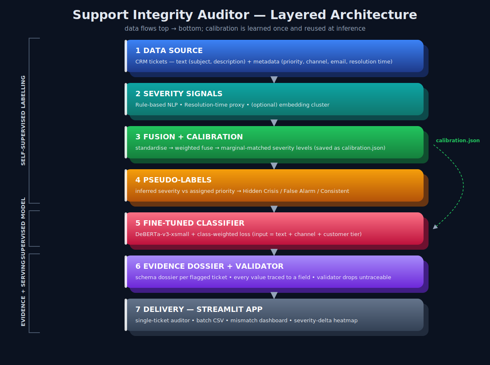
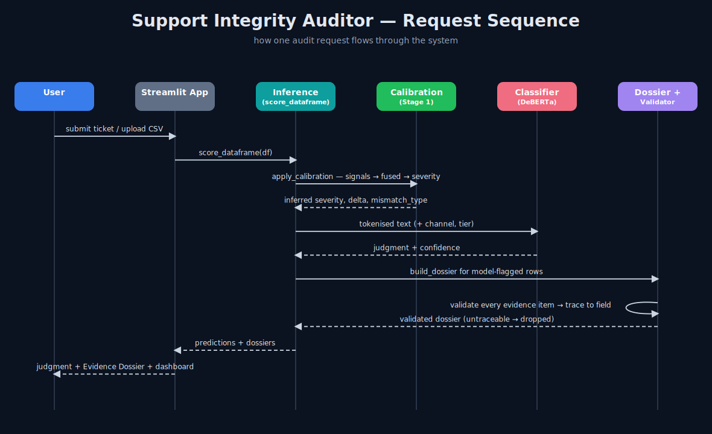

# Support Integrity Auditor (SIA)

SIA reads customer-support tickets and finds the ones whose **assigned priority does not match how serious the ticket really is**. There are two kinds of problem it looks for:

- **Hidden Crisis** — a serious ticket that was marked low (e.g. an outage marked "Low").
- **False Alarm** — a minor ticket that was marked urgent (e.g. "how do I change my avatar" marked "Critical").

The hard part of this project: there are **no ready-made labels** that say which tickets are mismatched. So SIA first teaches itself what "real severity" looks like from the raw data, and only then trains a model on top of that.

---

## How it works (in plain terms)

The system has three stages.

**Stage 1 — Make our own labels (self-supervised).**
We estimate each ticket's true severity from two independent signals:

1. **Language signal** — urgency and calm words in the subject and description (e.g. "data loss", "outage" push severity up; "no rush", "how do I" push it down).
2. **Resolution-time signal** — how long the ticket took to resolve, used as an indirect clue.

We standardise and blend these into one severity score, then turn it into a Low/Medium/High/Critical level. The level is **calibrated** so the overall mix matches the mix of human priorities — this stops the system from inventing mismatches just because of where a cut-off sits. Finally we compare the inferred level to the assigned priority: a big enough gap is labelled a mismatch.

This labelling is done once and its settings are saved to `calibration.json`, so a single new ticket is later scored exactly the same way the training tickets were.

**Stage 2 — Train a real classifier.**
We fine-tune **DeBERTa-v3-xsmall** on the Stage 1 labels (a small, memory-light model chosen so the app fits free hosting; `deberta-v3-small` or `base` also work if you have more RAM). Its input is the ticket text plus two pieces of structured metadata (the channel and a customer-tier guess from the email domain). Because real mismatches are rare, we use a **class-weighted loss** so the model does not ignore them. The model is what makes the final decision, and because it learns *meaning* (not just keywords) it can catch tricky tickets that have no obvious urgency words.

**Stage 3 — Explain every decision (Evidence Dossier).**
For each flagged ticket the system produces a structured dossier. The strict rule is that **every piece of evidence must come straight from a real ticket field** — keyword evidence is a word that actually appears in the ticket, and the resolution-time value is recomputed from the real timestamps. A built-in **validator** re-checks every item and throws away any dossier it cannot trace back to the source. This makes invented ("hallucinated") evidence impossible by design.

---

## Diagrams

**Layered architecture** — `docs/architecture.svg`


**Request sequence** — `docs/sequence.svg`


---

## Project structure

```
support-integrity-auditor/
├── README.md
├── requirements.txt
├── train_pipeline.py            # Stage 2: train the classifier (saves model + calibration + metrics)
├── predict.py                   # CLI: score a CSV -> predictions.csv + dossiers.json
├── app.py                       # Streamlit web app (single ticket + batch dashboard)
├── src/
│   ├── signals.py               # Stage 1 severity signals
│   ├── pseudo_label.py          # Stage 1 fusion, calibration, mismatch labels
│   ├── features.py              # builds the model input text (folds in metadata)
│   ├── dossier.py               # Stage 3 dossier + hallucination validator
│   └── inference.py             # shared scoring + dashboard helpers
├── scripts/
│   └── run_ablation.py          # signal-by-signal ablation table for the README
├── notebooks/
│   └── SIA_pipeline.ipynb       # full pipeline, runnable
├── tests/
│   └── sample_tickets.csv       # tiny example file to sanity-check the code
├── docs/
│   ├── architecture.svg
│   └── sequence.svg
└── data/                        # put the Kaggle CSV here (not committed)
```

---

## How to run

### 1. Setup

```bash
git clone <your-repo-url>
cd support-integrity-auditor
python -m venv .venv && source .venv/bin/activate     # Windows: .venv\Scripts\activate
pip install -r requirements.txt
```

### 2. Get the data

Download the **Customer Support Tickets — CRM Dataset** from Kaggle
(`kaggle.com/datasets/ajverse/customersupport-tickets-crm-dataset`) and save the CSV as:

```
data/customer_support_tickets.csv
```

### 3. Train (Stage 1 + Stage 2)

```bash
python train_pipeline.py --csv data/customer_support_tickets.csv --out artifacts --epochs 4
```

A GPU is strongly recommended — the free **Google Colab T4** is enough. This produces:

- `artifacts/model/` — the fine-tuned classifier
- `artifacts/calibration.json` — the saved Stage 1 settings
- `artifacts/metrics.json` — accuracy, macro-F1, per-class recall, confusion matrix, and a `verified: true/false` flag against the competition thresholds

### 4. Predict on new tickets

```bash
python predict.py --csv data/new_tickets.csv \
    --model artifacts/model --calibration artifacts/calibration.json --out predictions
```

Outputs `predictions/predictions.csv` and `predictions/dossiers.json` (only validated dossiers).

### 5. Run the web app

```bash
streamlit run app.py
```

Then use either tab: **Single ticket** (paste a ticket, get a judgment + dossier) or **Batch CSV** (upload a file, see the mismatch dashboard and severity-delta heatmap, download results).

### 6. Reproduce the ablation table

```bash
python scripts/run_ablation.py --csv data/customer_support_tickets.csv
```

---

## The Evidence Dossier format

Every flagged ticket gets a dossier in exactly this shape:

```json
{
  "ticket_id": "...",
  "assigned_priority": "Low",
  "inferred_severity": "Critical",
  "mismatch_type": "Hidden Crisis",
  "severity_delta": "+3",
  "feature_evidence": [
    { "signal": "keyword", "value": "data loss", "weight": 1.6 },
    { "signal": "resolution_time", "value": "57.0 hours", "interpretation": "slower than 75% of tickets — supports higher severity" }
  ],
  "constraint_analysis": "Assigned 'Low' but inferred 'Critical'. Language indicates higher severity than the label reflects: data loss, outage. Resolved in 57.0h, slower than 75% of tickets.",
  "confidence": 0.95
}
```

`feature_evidence` values are never written by the model — keywords are literal substrings of the ticket and the resolution time is recomputed from the timestamps, so `validate_dossier()` can prove every item is real.

---

## Evaluation

A submission is valid only if it clears all three thresholds on the held-out split:

| Metric | Minimum |
|---|---|
| Binary classification accuracy | ≥ 83% |
| Macro F1 | ≥ 0.82 |
| Per-class recall (both classes) | ≥ 0.78 |

`train_pipeline.py` prints these and writes them to `artifacts/metrics.json` with a `verified` flag, so there is no guesswork about whether the run passed.

**Important on the numbers:** the held-out metrics measure how well the *trained model* reproduces the Stage 1 labels on tickets it never saw — Stage 1 acts as an unsupervised annotator, the model only ever trains on the training split, and it is scored on the test split. The goal is generalisation, not memorising the rule; the adversarial tickets are where that difference shows up.

---

## Ablation (fill from your data)

Run `scripts/run_ablation.py` and paste the result here. It compares each signal alone against the fused version, and reports the agreement between the two signals. Use it to justify the fusion weights — the noisier signal (usually resolution time) should carry the smaller weight.

| Configuration | Mismatch rate | Hidden Crisis | False Alarm | Signal agreement (kappa) |
|---|---|---|---|---|
| rule only | … | … | … | n/a |
| restime only | … | … | … | n/a |
| fused (0.7 / 0.3) | … | … | … | … |

---

## Notes and limits

- Resolution time is a weak, noisy signal on purpose — that is why it is fused with the language signal rather than trusted alone, and why its direction is documented and configurable in `src/signals.py`.
- The dossier explanation is built from a fixed template over extracted facts (no free text generation in the evidence), which is the safest way to meet the zero-hallucination rule. An optional upgrade is to let an LLM rewrite *only* the `constraint_analysis` sentence from the already-extracted evidence, never the schema fields.
- An optional third signal (embedding clustering) is included for a richer ablation; enable it by adding `"embed"` to the signals list (needs `sentence-transformers`).
